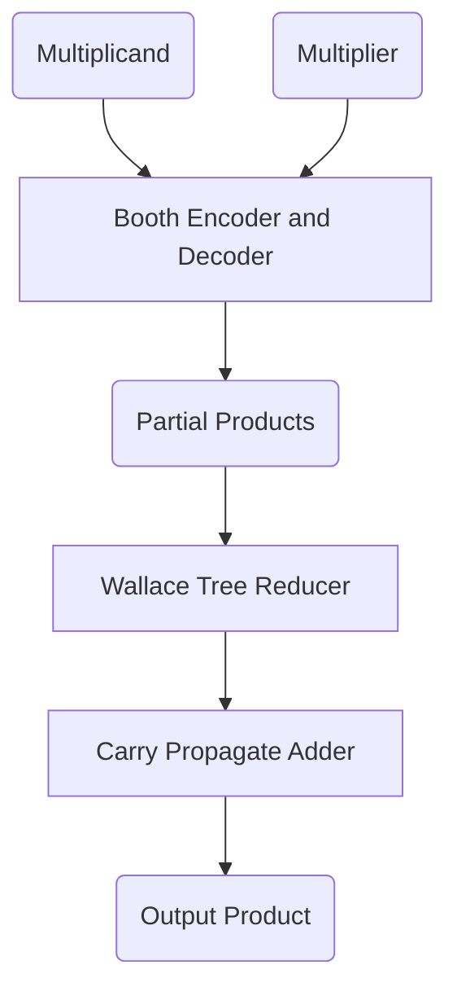

<!-- element with id at top of page -->
<div id="back-to-top"></div>


# Radix-4 Modified Booth Multiplier (MBM)

## Abstract

Adders and multipliers are fundamental components of many circuits. Specifically, multiplication operations are the fundamental computational function in applications such as digital signal processing and machine learning, where multiplier performance plays a crucial role in the overall system behavior.  

The radix-4 modified Booth multiplier (MBM), reduces the number of partial products by 50%. This increases speed, reduces power consumption and saves space on the multiplier layout. Furthermore, the use of Carry Save adders, arranged in Wallace tree structure, for the accumulation of the partial products and a CLA adder, used as the last stage of the adder tree for the final addition, ensures further improvements in the use of logical resources (greater savings in occupied area) and performance in terms of speed and power compared to conventional multipliers.  

This repository contains the VHDL code for a multiplier using the Booth radix-4 algorithm, taking as inputs two signed numbers, A<sub>N-bit, multiplicand</sub> &times; B<sub>M-bit, multiplier</sub> (with M = 8 or 16), in 2's complement notation and returning as output a signed number, Ris<sub>(N+M)-bit</sub>, in 2's complement notation. The radix-4 Booth algorithm computes the two inputs into M/2 partial products. These partial products are passed through an Wallace tree adder structure, which returns two final partial products. These two partial products are then subjected to a further carry-free addition (CLA adder) to produce the final result.  

> [!NOTE]
> The repository includes the testbench used for functional verification of the proposed architecture using the Xilinx Vivado Design Suite simulation environment. The simulation results confirm the correctness of the multiplication operations for all permitted input combinations, i.e., the N-bit signed multiplicand and M-bit signed multiplier.

## How It Works



1. **Inputs**: Multiplicand and Multiplier (both signed/unsigned).
2. **Booth Encoder and Decoder**: Generates encoded partial products from the multiplier.
3. **Wallace Tree**: Parallel reduction of partial products using layers of adders (e.g., carry-save adder).
4. **Final Adder**: The last two rows are summed using a fast adder (e.g., carry-lookahead adder).
5. **Output**: Accurate product.

## Theory

The multiplication operation typically involves three main processes:
1. **Generation of partial products:** Performing the multiplication operation between the "multiplicand" and the "multiplier" produces intermediate data called "partial products."
2. **Compression or accumulation of partial products:** using a specific tree structure to condense multiple generated partial products into two.
3. **Final addition:** Using an adder to add the two partial products obtained from compression, the final product is obtained.  

Radix-4 Booth encoding algorithm is used to generate partial products. The Wallace tree structure allows for the compression of the partial products, and a CLA adder adds the two partial products output from the tree structure to obtain the final product.  
The principles of Booth radix-4 algorithm and the Wallace tree scheme with final adder are briefly introduced below.

### Radix-4 Booth Encoder and Decoder

They contribute to the generation of partial products.  

The **encoder** implements the radix-4 Booth algorithm, according to which the multiplier (B) is partitioned into groups of three adjacent bits, with each preceding and succeeding group overlapping by one bit position. It is possible to identify up to 2<sup>3</sup> = 8 different groups. An auxiliary bit '0' is added to the far right of B, acting as the least significant bit (LSB), to complete the last triplet.  


Each triplet is associated with an encoding digit, one of {-2, -1, 0, 1, 2}, used to determine the corresponding partial product, obtained by multiplying the digit itself by the multiplicand (A).  
The advantage of radix-4 Booth encoding algorithm lies in its ability to halve the number of partial products generated, reducing computational complexity and, consequently, processing time. In addition to its high-speed characteristics, this algorithm also features low power consumption.

The following table shows the rules for generating the encoding digits of the respective triplets and the corresponding partial products.  

| B<sub>i+1</sub> B<sub>i</sub> B<sub>i-1</sub> | Recorded Digits | Partial Products |
| :-------------------------------------------: | :-------------: | :--------------: |
|                     0 0 0                     |        0        |        0         |
|                     0 0 1                     |        1        |        A         |
|                     0 1 0                     |        1        |        A         |
|                     0 1 1                     |        2        |       2A         |
|                     1 0 0                     |       -2        |      -2A         |
|                     1 0 1                     |       -1        |       -A         |
|                     1 1 0                     |       -1        |       -A         |
|                     1 1 1                     |        0        |        0         |

As can be seen from the table, there are five categories of partial product in the Radix-4 Booth encoding scheme: `0`, `+A`, `+2A`, `-A`, and `-2A`.  
Among these:  
- `0` is the constant term.
- `+A` is the multiplicand.
- `+2A` is obtained by shifting `+A` one bit to the left.

Regarding the generation of `-A` and `-2A`, shifting `-A` one position to the left yields `-2A`. Generating the operand `-A` requires an additional circuit resource, namely an adder (RCA, CLA adder or other). Therefore, for an N-bit multiplicand, (N+2)-bits are needed to represent the generic partial product: one bit is required to represent `2A` and another is required to represent `-A = not(A) + 1` (signed extension for signed numbers in 2's complement notation).

> [!NOTE]
> These quantities are all readily available. In fact, knowing the value of A, it is possible to predetermine all possible values ​​of the partial products.

The **decoder**, i.e. a 5:1 multiplexer (MUX), receives as input all possible pre-calculated partial products and returns as output the partial product as a function of the encoding digit output by the encoder and used as a MUX selector.
> [!NOTE]
> The partial products output by the decoders, before being added, must be left-shifted by an amount equal to the weight of the central bit of the respective triplet and signed extended to align them.
> The weight of the central bit of each triplet has a step of two, that is, starting from the multiplier LSB (excluding the additional bit '0'): 2<sup>0</sup>, 2<sup>2</sup>, 2<sup>4</sup>, 2<sup>6</sup>, 2<sup>8</sup>, etc.

### Wallace Tree Structure

The Wallace tree uses Carry Save adders (3:2 compressor), rather than Ripple Carry adders, to accumulate partial products.  
A 3:2 compressor, as shown in the figure below, consists of a chain of FAs that accepts three inputs and generates two outputs: a partial sum vector (VSP) and a carry vector (VR). Each sum bit is computed without waiting for the carry bit to propagate, which is instead output.  
Subsequently, a logical **left shift of VR** is performed and the **VSP is signed-extended** so that the two vectors are aligned (this operation costs nothing in terms of time and resources).
Since the sum and carry bits are computed in parallel due to no carry propagation, the computation time of VSP and VR at each level of the tree structure is equal to that of a single FA.

.png)

The equations governing the outputs of the 3:2 compressor are shown below.

Sum<sub>i</sub> = A<sub>i</sub> <em>xor</em> B<sub>i</sub> <em>xor</em> C<sub>i</sub>  
Carry<sub>i</sub> = (A<sub>i</sub> <em>xand</em> B<sub>i</sub>) <em>or</em> (A<sub>i</sub> <em>xand</em> C<sub>i</sub>) <em>or</em> (B<sub>i</sub> <em>xand</em> C<sub>i</sub>)

The following figure illustrates the structure of a typical 4-input Wallace adder tree.


The number of levels in the Wallace tree using 3:2 compressors can be approximately given as:

$$Number of levels = \frac{log\left( \frac{k}{2} \right)}{log \left(\frac{3}{2} \right)}$$

Where, k is the number of partial products.

### Final Stage Addition

This stage is crucial because it involves the addition of large operands coming out of the Wallace tree, so at this stage, fast carry propagation adders such as Carry-look Ahead Adder or Carry Skip Adder or Carry Select Adder can be used as per the requirements.  

> [!NOTE]
> For the final adder, a CLA adder has been implemented, however, the VHDL code of an RCA adder is provided as an alternative.

The result of the multiplication operation is represented in (N+M)-bits.

## Theorical Architectural Overview

The structural block diagram is as follows:
1. **Booth Encoder and Decoder:** Coding of multiplier triples and generation of partial products.  
To generate the corresponding encoded digit, the encoder was implemented with a combinational network that uses the "<em>modulus and sign</em>" representation (MSB indicates the sign, while the other two bits quantify the modulus). This combinational circuit allows for circuit-level simplifications; in particular, it ensures a reduction in decoder fan-in (5:1 MUX instead of 8:1 MUX) and, consequently, a reduction in power dissipation.  

2. **Pre-calculation logic:** To preliminarily calculate all the possible partial products (`ExA`->`A`, `DA`->`2A`, `MA`->`-A`, `MDA`->`-2A`). An CLA adder is used to generate the partial product `-A`.

> [!NOTE]
> The partial product '0' is processed directly in the decoder module as it is a constant.
3. **Adder Tree (Wallace tree + CLA adder):** Using a Wallace tree structure, the partial products are added and compressed into two final partial products, which are then used in the final addition via a CLA adder to obtain the final product result.
4. **Pipelining:** Adoption of a 3-stage pipeline structure to minimize power dissipation attributed to spurious signal switching (i.e., glitches) and to reduce the critical path.  

The following figure illustrates the entire architecture of the radix-4 Booth multiplier, excluding the pipeline stages.


## Verification

This section describes the simulation of Radix-4 Modified Booth Multiplier circuit in VHDL using Wallace tree approach and pipelining technique.  
The design was verified using the `Booth_mult_tb.vhd` testbench. This testbench is self-checking and uses assert statements to automatically report errors.
The code is synthesized using Pynq-Z2 development board with device selected as xc7z0201-clg400.  

### Simulation and Analysis Post-Implementation

The results are for the signed and unsigned multiplication of 9-bit multiplicand and 8-bit multiplier depending upon partial product generation by Radix-4 Booth encoder Logic, partial product reduction by 3:2 compressors and final adder addition. The choice of optimum multiplier involves three key factors: Area, propagation delay, reconfiguration time. The MBM reduce the partial products to half to provide the speed advantage. The primary source of propagation delay in circuit is the adder, so the 3:2 compressor used for Wallace tree to add the partial products, the layers of 3:2 compressors is used to decrease the propagation delay is formulated as Wallace Tree.The area utilization depends upon the number of LUT’s (Look Up Table) and SLICES used for synthesizing the code. The **clock period** of **11ns** is produced and the **clock frequency** is **90.91MHz**.


    
Table below shows the utilization of hardware by the given MBM with pipelining.  
  
| **Logic Utilization** | **Used** | **Util%** |
| :-------------------: | :------: | :-------: |
|		  Slices    	|    45	   |    0.34   |
|	   LUT as Logic 	|   135    |	0.25   |
|	  Registers as FF	|    64    |	0.06   |
|       Bonded IOB		|    37    |   29.60   |
|          GCLKs		|     1    |	3.13   |  
  
## Getting Started For Test

### Prerequisites

- Minimum 4GB RAM and a multi-core processor.
- Xilinx Vivado Design Suite.
- Knowledge of VHDL.
- Basic understanding of signals and systems.

### Steps to Run the Project

1. Clone the repository:
   ```bash
   git clone https://github.com/ElecGiuseppe-lab/Radix-4_Booth_Multiplier.git
   ```
2. Open Vivado and create a new project.
3. Add the provided VHDL source files (the VHDL source files are located in the `Booth_mult_optDynEn/src` directory).
4. Add time constraint (the file is located in the `Booth_mult_optDynEn/constrs` directory).
4. Run synthesis and implementation.
5. Run post-implementation timing simulation and observe the output waveforms (the corresponding testbench are in the `Booth_mult_optDynEn/sim` directory).

  
<!-- The link you click to go back to top -->
<div align="right">
  &#8673; <a href="#back-to-top" title="Table of Contents">Back to Top</a>
</div>
